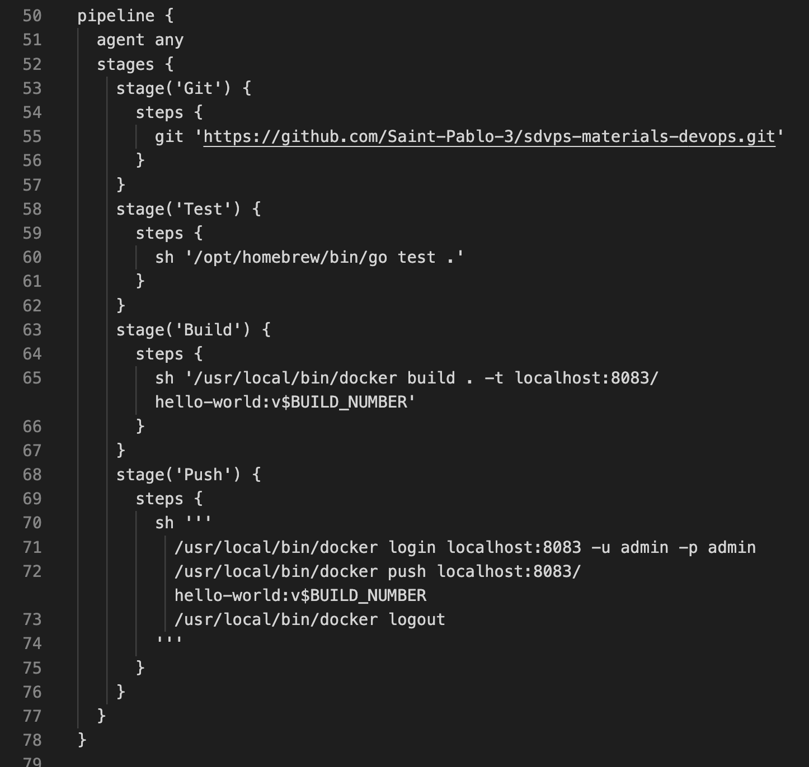

# Домашнее задание к занятию "Что такое DevOps. СI/СD" - `Решетов Павел`

### Инструкция по выполнению домашнего задания

   1. Сделайте `fork` данного репозитория к себе в Github и переименуйте его по названию или номеру занятия, например, https://github.com/имя-вашего-репозитория/git-hw или  https://github.com/имя-вашего-репозитория/7-1-ansible-hw).
   2. Выполните клонирование данного репозитория к себе на ПК с помощью команды `git clone`.
   3. Выполните домашнее задание и заполните у себя локально этот файл README.md:
      - впишите вверху название занятия и вашу фамилию и имя
      - в каждом задании добавьте решение в требуемом виде (текст/код/скриншоты/ссылка)
      - для корректного добавления скриншотов воспользуйтесь [инструкцией "Как вставить скриншот в шаблон с решением](https://github.com/netology-code/sys-pattern-homework/blob/main/screen-instruction.md)
      - при оформлении используйте возможности языка разметки md (коротко об этом можно посмотреть в [инструкции  по MarkDown](https://github.com/netology-code/sys-pattern-homework/blob/main/md-instruction.md))
   4. После завершения работы над домашним заданием сделайте коммит (`git commit -m "comment"`) и отправьте его на Github (`git push origin`);
   5. Для проверки домашнего задания преподавателем в личном кабинете прикрепите и отправьте ссылку на решение в виде md-файла в вашем Github.
   6. Любые вопросы по выполнению заданий спрашивайте в чате учебной группы и/или в разделе “Вопросы по заданию” в личном кабинете.
   
Желаем успехов в выполнении домашнего задания!
   
### Дополнительные материалы, которые могут быть полезны для выполнения задания

1. [Руководство по оформлению Markdown файлов](https://gist.github.com/Jekins/2bf2d0638163f1294637#Code)

---

### Задание 1

Установите себе jenkins по инструкции из лекции или любым другим способом из официальной документации. Использовать Docker в этом задании нежелательно.
Установите на машину с jenkins golang.
Используя свой аккаунт на GitHub, сделайте себе форк репозитория. В этом же репозитории находится дополнительный материал для выполнения ДЗ.
Создайте в jenkins Freestyle Project, подключите получившийся репозиторий к нему и произведите запуск тестов и сборку проекта go test . и  docker build ..
В качестве ответа пришлите скриншоты с настройками проекта и результатами выполнения сборки.

`При необходимости прикрепитe сюда скриншоты`

---

### Задание 2

`Создайте новый проект pipeline.
Перепишите сборку из задания 1 на declarative в виде кода.
В качестве ответа пришлите скриншоты с настройками проекта и результатами выполнения сборки.`

скрипт build для pipeline (не влез в окно полностью скрин):

pipeline {
  agent any
  stages {
    stage('Git') {
      steps {
        git 'https://github.com/Saint-Pablo-3/sdvps-materials-devops.git'
      }
    }
    stage('Test') {
      steps {
        sh '/opt/homebrew/bin/go test .'
      }
    }
    stage('Build') {
      steps {
        sh '/usr/local/bin/docker build . -t localhost:8083/hello-world:v$BUILD_NUMBER'
      }
    }
    stage('Push') {
      steps {
        sh '''
          /usr/local/bin/docker login localhost:8083 -u admin -p admin
          /usr/local/bin/docker push localhost:8083/hello-world:v$BUILD_NUMBER
          /usr/local/bin/docker logout
        '''
      }
    }
  }
}

`При необходимости прикрепитe сюда скриншоты`

---

### Задание 3

`Установите на машину Nexus.
Создайте raw-hosted репозиторий.
Измените pipeline так, чтобы вместо Docker-образа собирался бинарный go-файл. Команду можно скопировать из Dockerfile.
Загрузите файл в репозиторий с помощью jenkins.
`

`При необходимости прикрепитe сюда скриншоты`

